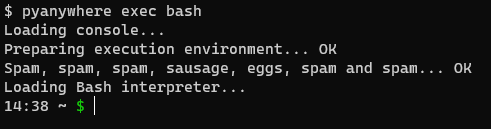

# PythonAnywhereTerminal


This repository provides you a simple way to open PythonAnywhere consoles without using an API token.  
The authentication is based of username and password.

## Installing

Installing using pip:
```bash
pip install https://github.com/naweiss/PythonAnywhereTerminal.git
```

## Usage

```python
from pythonanywhere_terminal.event_loop import start_terminal
from pythonanywhere_terminal.session.remote import PythonAnywhereClient, Console

with PythonAnywhereClient(username=arguments.username, password=arguments.password) as client:
    if arguments.command == 'list':
        for console_details in client.list_consoles():
            print(str(Console(console_details)))
    
    elif arguments.command == 'exec':
        start_terminal(client, arguments.executable)
```

## CLI tool

When installing this package a console script called `pyanywhere` will be installed.

### Usage

```
usage: pyanywhere list [-h] --username USERNAME [--password PASSWORD] [-v]
                       [-c CONFIG]

Args that start with '--' (eg. --username) can also be set in a config file
(./.anywhere.ini or ~/.anywhere.ini or specified via -c). Config file syntax
allows: key=value, flag=true, stuff=[a,b,c] (for details, see syntax at
https://goo.gl/R74nmi). If an arg is specified in more than one place, then
commandline values override config file values which override defaults.

optional arguments:
  -h, --help            show this help message and exit
  --username USERNAME   account username
  --password PASSWORD   account password
  -v, --verbose         verbose logging
  -c CONFIG, --config CONFIG
                        config file path
```

```
usage: pyanywhere exec [-h] --username USERNAME [--password PASSWORD] [-v]
                       [-c CONFIG] [--windowed] [--auto-close]
                       executable

Args that start with '--' (eg. --username) can also be set in a config file
(./.anywhere.ini or ~/.anywhere.ini or specified via -c). Config file syntax
allows: key=value, flag=true, stuff=[a,b,c] (for details, see syntax at
https://goo.gl/R74nmi). If an arg is specified in more than one place, then
commandline values override config file values which override defaults.

positional arguments:
  executable            open a new console of the give executable

optional arguments:
  -h, --help            show this help message and exit
  --username USERNAME   account username
  --password PASSWORD   account password
  -v, --verbose         verbose logging
  -c CONFIG, --config CONFIG
                        config file path
  --windowed            run using curses
  --auto-close          close the console when " Console closed." is received
```

### Configuration

The configuration file `.anywhere.ini` for the CLI tool pyanywhere is read (in order) from:
* The current directory
* The home directory of the user

Overwriting the configuration flags is possible using command line arguments.

### Example

To list open consoles:
```
$ pyanywhere list
12341234# Bash console 12341234: running bash
```

To open a bash shell run:
```
pyanywhere exec bash
```



You can also run this command with any executable name:
```
pyanywhere exec ls
```

---
**NOTE**

Command line arguments are not supported.

---

To connect to an existing console simply run exec with the executable name.
